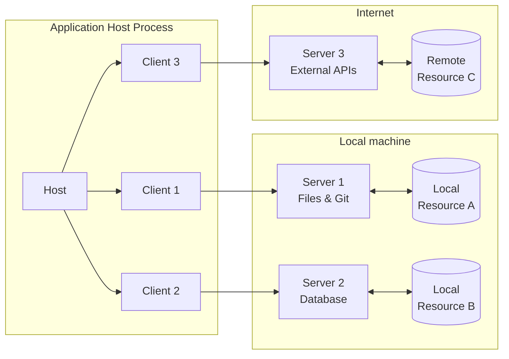
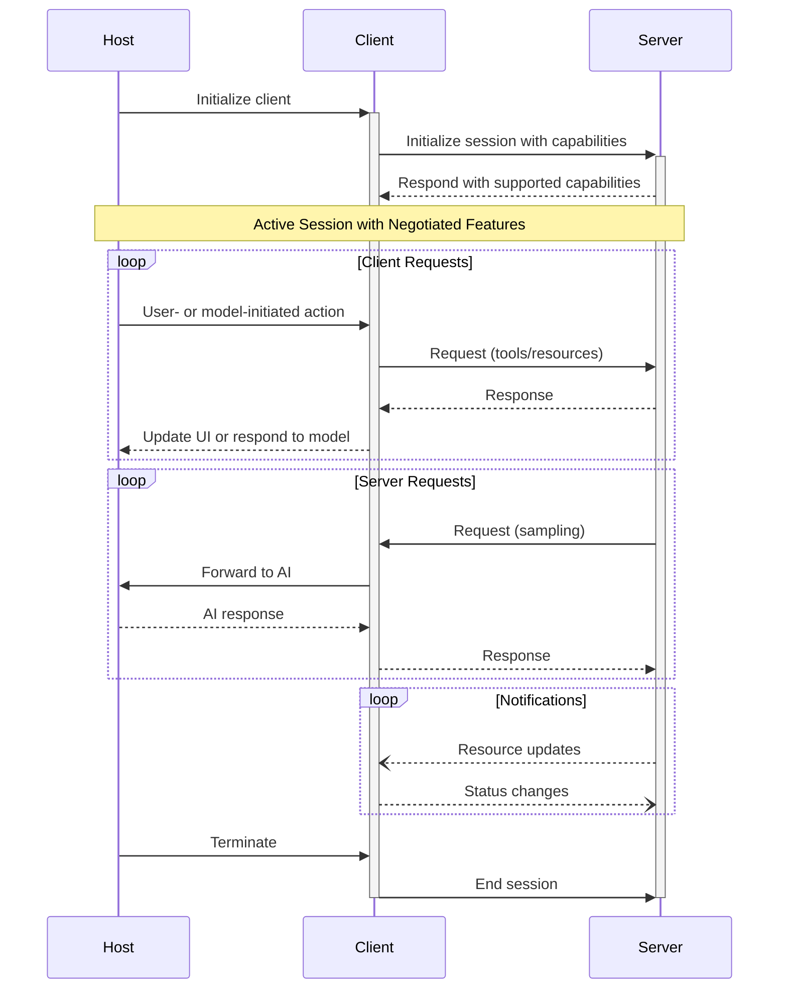
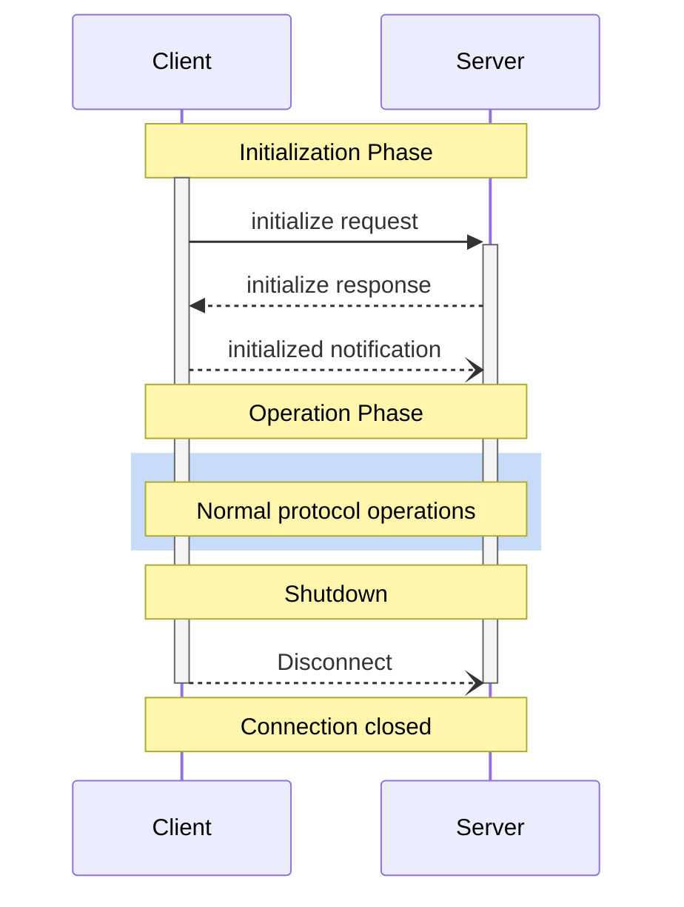
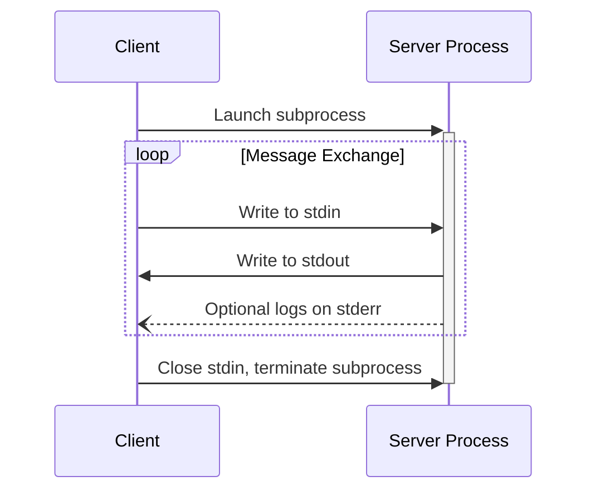
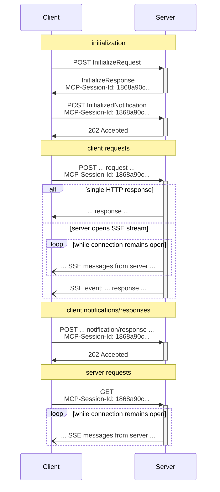
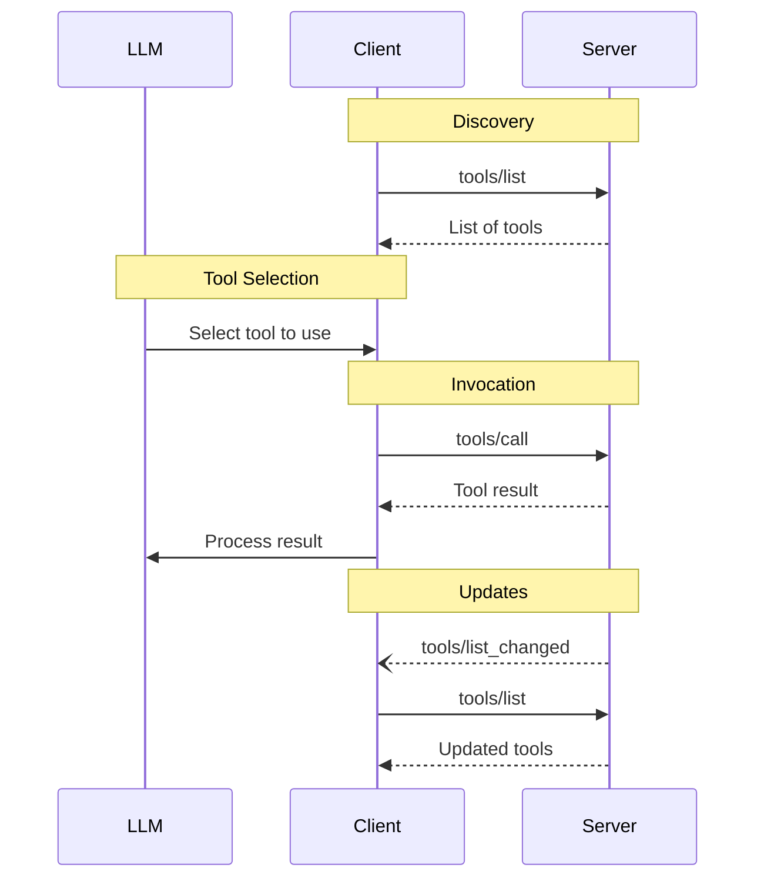
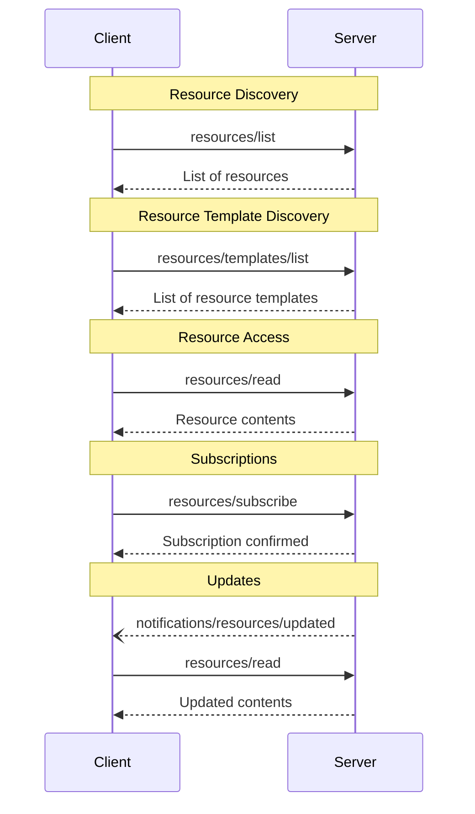
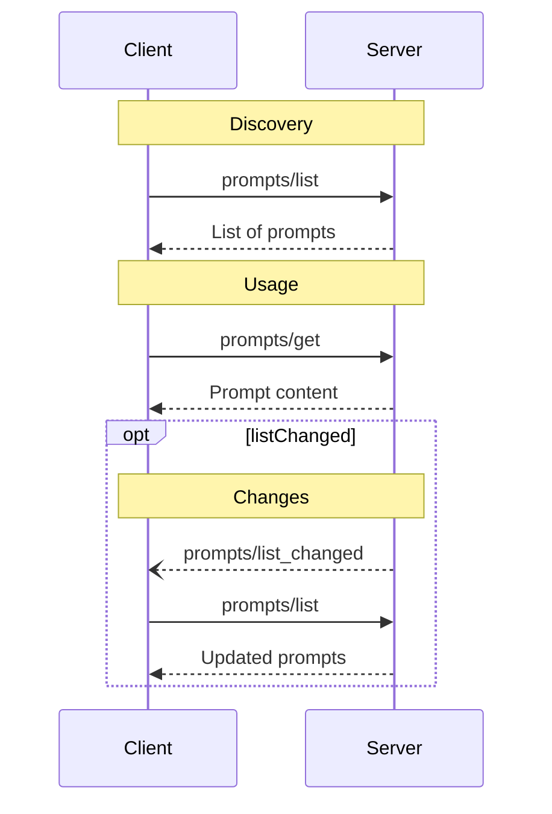
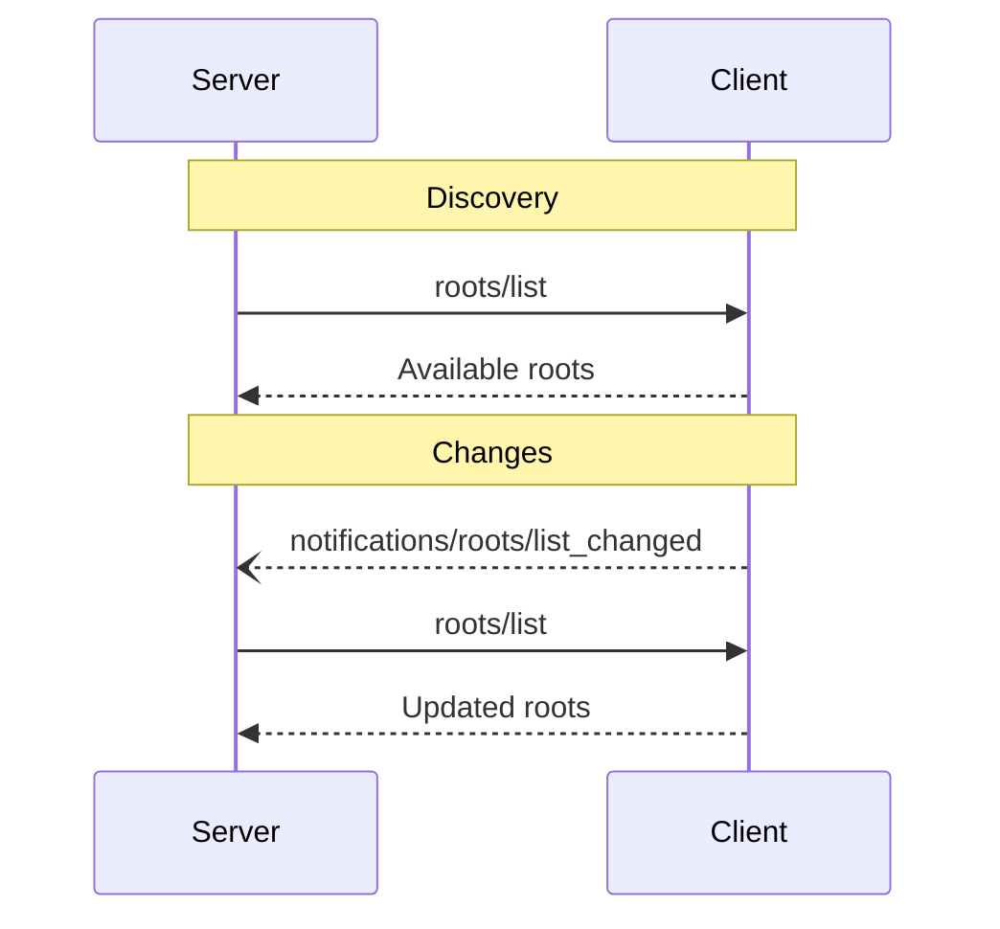

# MCP Specification 2025-11-25 (Complete Reference)
**Source**: https://modelcontextprotocol.io/specification/2025-11-25
This is a compiled reference copy of the official Model Context Protocol (MCP) 2025-11-25 specification for use within the aimo-mcp-client module. The specification is published by the Model Context Protocol project under the MIT License.
For the authoritative version and latest updates, visit https://modelcontextprotocol.io/specification/2025-11-25
---
> ## Documentation Index
> Fetch the complete documentation index at: https://modelcontextprotocol.io/llms.txt
> Use this file to discover all available pages before exploring further.

# Specification

<div id="enable-section-numbers" />

[Model Context Protocol](https://modelcontextprotocol.io) (MCP) is an open protocol that
enables seamless integration between LLM applications and external data sources and
tools. Whether you're building an AI-powered IDE, enhancing a chat interface, or creating
custom AI workflows, MCP provides a standardized way to connect LLMs with the context
they need.

This specification defines the authoritative protocol requirements, based on the
TypeScript schema in
[schema.ts](https://github.com/modelcontextprotocol/specification/blob/main/schema/2025-11-25/schema.ts).

For implementation guides and examples, visit
[modelcontextprotocol.io](https://modelcontextprotocol.io).

The key words "MUST", "MUST NOT", "REQUIRED", "SHALL", "SHALL NOT", "SHOULD", "SHOULD
NOT", "RECOMMENDED", "NOT RECOMMENDED", "MAY", and "OPTIONAL" in this document are to be
interpreted as described in [BCP 14](https://datatracker.ietf.org/doc/html/bcp14)
\[[RFC2119](https://datatracker.ietf.org/doc/html/rfc2119)]
\[[RFC8174](https://datatracker.ietf.org/doc/html/rfc8174)] when, and only when, they
appear in all capitals, as shown here.

## Overview

MCP provides a standardized way for applications to:

* Share contextual information with language models
* Expose tools and capabilities to AI systems
* Build composable integrations and workflows

The protocol uses [JSON-RPC](https://www.jsonrpc.org/) 2.0 messages to establish
communication between:

* **Hosts**: LLM applications that initiate connections
* **Clients**: Connectors within the host application
* **Servers**: Services that provide context and capabilities

MCP takes some inspiration from the
[Language Server Protocol](https://microsoft.github.io/language-server-protocol/), which
standardizes how to add support for programming languages across a whole ecosystem of
development tools. In a similar way, MCP standardizes how to integrate additional context
and tools into the ecosystem of AI applications.

## Key Details

### Base Protocol

* [JSON-RPC](https://www.jsonrpc.org/) message format
* Stateful connections
* Server and client capability negotiation

### Features

Servers offer any of the following features to clients:

* **Resources**: Context and data, for the user or the AI model to use
* **Prompts**: Templated messages and workflows for users
* **Tools**: Functions for the AI model to execute

Clients may offer the following features to servers:

* **Sampling**: Server-initiated agentic behaviors and recursive LLM interactions
* **Roots**: Server-initiated inquiries into URI or filesystem boundaries to operate in
* **Elicitation**: Server-initiated requests for additional information from users

### Additional Utilities

* Configuration
* Progress tracking
* Cancellation
* Error reporting
* Logging

## Security and Trust & Safety

The Model Context Protocol enables powerful capabilities through arbitrary data access
and code execution paths. With this power comes important security and trust
considerations that all implementors must carefully address.

### Key Principles

1. **User Consent and Control**
   * Users must explicitly consent to and understand all data access and operations
   * Users must retain control over what data is shared and what actions are taken
   * Implementors should provide clear UIs for reviewing and authorizing activities

2. **Data Privacy**
   * Hosts must obtain explicit user consent before exposing user data to servers
   * Hosts must not transmit resource data elsewhere without user consent
   * User data should be protected with appropriate access controls

3. **Tool Safety**
   * Tools represent arbitrary code execution and must be treated with appropriate
     caution.
     * In particular, descriptions of tool behavior such as annotations should be
       considered untrusted, unless obtained from a trusted server.
   * Hosts must obtain explicit user consent before invoking any tool
   * Users should understand what each tool does before authorizing its use

4. **LLM Sampling Controls**
   * Users must explicitly approve any LLM sampling requests
   * Users should control:
     * Whether sampling occurs at all
     * The actual prompt that will be sent
     * What results the server can see
   * The protocol intentionally limits server visibility into prompts

### Implementation Guidelines

While MCP itself cannot enforce these security principles at the protocol level,
implementors **SHOULD**:

1. Build robust consent and authorization flows into their applications
2. Provide clear documentation of security implications
3. Implement appropriate access controls and data protections
4. Follow security best practices in their integrations
5. Consider privacy implications in their feature designs

## Learn More

Explore the detailed specification for each protocol component:

<CardGroup cols={5}>
  <Card title="Architecture" icon="sitemap" href="/specification/2025-11-25/architecture" />

  <Card title="Base Protocol" icon="code" href="/specification/2025-11-25/basic" />

  <Card title="Server Features" icon="server" href="/specification/2025-11-25/server" />

  <Card title="Client Features" icon="user" href="/specification/2025-11-25/client" />

  <Card title="Contributing" icon="pencil" href="/community/contributing" />
</CardGroup>

---
## Architecture Details
> ## Documentation Index
> Fetch the complete documentation index at: https://modelcontextprotocol.io/llms.txt
> Use this file to discover all available pages before exploring further.

# Architecture

<div id="enable-section-numbers" />

The Model Context Protocol (MCP) follows a client-host-server architecture where each
host can run multiple client instances. This architecture enables users to integrate AI
capabilities across applications while maintaining clear security boundaries and
isolating concerns. Built on JSON-RPC, MCP provides a stateful session protocol focused
on context exchange and sampling coordination between clients and servers.

## Core Components



### Host

The host process acts as the container and coordinator:

* Creates and manages multiple client instances
* Controls client connection permissions and lifecycle
* Enforces security policies and consent requirements
* Handles user authorization decisions
* Coordinates AI/LLM integration and sampling
* Manages context aggregation across clients

### Clients

Each client is created by the host and maintains an isolated server connection:

* Establishes one stateful session per server
* Handles protocol negotiation and capability exchange
* Routes protocol messages bidirectionally
* Manages subscriptions and notifications
* Maintains security boundaries between servers

A host application creates and manages multiple clients, with each client having a 1:1
relationship with a particular server.

### Servers

Servers provide specialized context and capabilities:

* Expose resources, tools and prompts via MCP primitives
* Operate independently with focused responsibilities
* Request sampling through client interfaces
* Must respect security constraints
* Can be local processes or remote services

## Design Principles

MCP is built on several key design principles that inform its architecture and
implementation:

1. **Servers should be extremely easy to build**
   * Host applications handle complex orchestration responsibilities
   * Servers focus on specific, well-defined capabilities
   * Simple interfaces minimize implementation overhead
   * Clear separation enables maintainable code

2. **Servers should be highly composable**
   * Each server provides focused functionality in isolation
   * Multiple servers can be combined seamlessly
   * Shared protocol enables interoperability
   * Modular design supports extensibility

3. **Servers should not be able to read the whole conversation, nor "see into" other
   servers**
   * Servers receive only necessary contextual information
   * Full conversation history stays with the host
   * Each server connection maintains isolation
   * Cross-server interactions are controlled by the host
   * Host process enforces security boundaries

4. **Features can be added to servers and clients progressively**
   * Core protocol provides minimal required functionality
   * Additional capabilities can be negotiated as needed
   * Servers and clients evolve independently
   * Protocol designed for future extensibility
   * Backwards compatibility is maintained

## Capability Negotiation

The Model Context Protocol uses a capability-based negotiation system where clients and
servers explicitly declare their supported features during initialization. Capabilities
determine which protocol features and primitives are available during a session.

* Servers declare capabilities like resource subscriptions, tool support, and prompt
  templates
* Clients declare capabilities like sampling support and notification handling
* Both parties must respect declared capabilities throughout the session
* Additional capabilities can be negotiated through extensions to the protocol



Each capability unlocks specific protocol features for use during the session. For
example:

* Implemented [server features](/specification/2025-11-25/server) must be advertised in the
  server's capabilities
* Emitting resource subscription notifications requires the server to declare
  subscription support
* Tool invocation requires the server to declare tool capabilities
* [Sampling](/specification/2025-11-25/client/sampling) requires the client to declare support in its
  capabilities

This capability negotiation ensures clients and servers have a clear understanding of
supported functionality while maintaining protocol extensibility.

---
## Lifecycle
> ## Documentation Index
> Fetch the complete documentation index at: https://modelcontextprotocol.io/llms.txt
> Use this file to discover all available pages before exploring further.

# Lifecycle

<div id="enable-section-numbers" />

The Model Context Protocol (MCP) defines a rigorous lifecycle for client-server
connections that ensures proper capability negotiation and state management.

1. **Initialization**: Capability negotiation and protocol version agreement
2. **Operation**: Normal protocol communication
3. **Shutdown**: Graceful termination of the connection



## Lifecycle Phases

### Initialization

The initialization phase **MUST** be the first interaction between client and server.
During this phase, the client and server:

* Establish protocol version compatibility
* Exchange and negotiate capabilities
* Share implementation details

The client **MUST** initiate this phase by sending an `initialize` request containing:

* Protocol version supported
* Client capabilities
* Client implementation information

```json theme={null}
{
  "jsonrpc": "2.0",
  "id": 1,
  "method": "initialize",
  "params": {
    "protocolVersion": "2025-11-25",
    "capabilities": {
      "roots": {
        "listChanged": true
      },
      "sampling": {},
      "elicitation": {
        "form": {},
        "url": {}
      },
      "tasks": {
        "requests": {
          "elicitation": {
            "create": {}
          },
          "sampling": {
            "createMessage": {}
          }
        }
      }
    },
    "clientInfo": {
      "name": "ExampleClient",
      "title": "Example Client Display Name",
      "version": "1.0.0",
      "description": "An example MCP client application",
      "icons": [
        {
          "src": "https://example.com/icon.png",
          "mimeType": "image/png",
          "sizes": ["48x48"]
        }
      ],
      "websiteUrl": "https://example.com"
    }
  }
}
```

The server **MUST** respond with its own capabilities and information:

```json theme={null}
{
  "jsonrpc": "2.0",
  "id": 1,
  "result": {
    "protocolVersion": "2025-11-25",
    "capabilities": {
      "logging": {},
      "prompts": {
        "listChanged": true
      },
      "resources": {
        "subscribe": true,
        "listChanged": true
      },
      "tools": {
        "listChanged": true
      },
      "tasks": {
        "list": {},
        "cancel": {},
        "requests": {
          "tools": {
            "call": {}
          }
        }
      }
    },
    "serverInfo": {
      "name": "ExampleServer",
      "title": "Example Server Display Name",
      "version": "1.0.0",
      "description": "An example MCP server providing tools and resources",
      "icons": [
        {
          "src": "https://example.com/server-icon.svg",
          "mimeType": "image/svg+xml",
          "sizes": ["any"]
        }
      ],
      "websiteUrl": "https://example.com/server"
    },
    "instructions": "Optional instructions for the client"
  }
}
```

After successful initialization, the client **MUST** send an `initialized` notification
to indicate it is ready to begin normal operations:

```json theme={null}
{
  "jsonrpc": "2.0",
  "method": "notifications/initialized"
}
```

* The client **SHOULD NOT** send requests other than
  [pings](/specification/2025-11-25/basic/utilities/ping) before the server has responded to the
  `initialize` request.
* The server **SHOULD NOT** send requests other than
  [pings](/specification/2025-11-25/basic/utilities/ping) and
  [logging](/specification/2025-11-25/server/utilities/logging) before receiving the `initialized`
  notification.

#### Version Negotiation

In the `initialize` request, the client **MUST** send a protocol version it supports.
This **SHOULD** be the *latest* version supported by the client.

If the server supports the requested protocol version, it **MUST** respond with the same
version. Otherwise, the server **MUST** respond with another protocol version it
supports. This **SHOULD** be the *latest* version supported by the server.

If the client does not support the version in the server's response, it **SHOULD**
disconnect.

<Note>
  If using HTTP, the client **MUST** include the `MCP-Protocol-Version: <protocol-version>` HTTP header on all subsequent requests to the MCP
  server.
  For details, see [the Protocol Version Header section in Transports](/specification/2025-11-25/basic/transports#protocol-version-header).
</Note>

#### Capability Negotiation

Client and server capabilities establish which optional protocol features will be
available during the session.

Key capabilities include:

| Category | Capability     | Description                                                                                   |
| -------- | -------------- | --------------------------------------------------------------------------------------------- |
| Client   | `roots`        | Ability to provide filesystem [roots](/specification/2025-11-25/client/roots)                 |
| Client   | `sampling`     | Support for LLM [sampling](/specification/2025-11-25/client/sampling) requests                |
| Client   | `elicitation`  | Support for server [elicitation](/specification/2025-11-25/client/elicitation) requests       |
| Client   | `tasks`        | Support for [task-augmented](/specification/2025-11-25/basic/utilities/tasks) client requests |
| Client   | `experimental` | Describes support for non-standard experimental features                                      |
| Server   | `prompts`      | Offers [prompt templates](/specification/2025-11-25/server/prompts)                           |
| Server   | `resources`    | Provides readable [resources](/specification/2025-11-25/server/resources)                     |
| Server   | `tools`        | Exposes callable [tools](/specification/2025-11-25/server/tools)                              |
| Server   | `logging`      | Emits structured [log messages](/specification/2025-11-25/server/utilities/logging)           |
| Server   | `completions`  | Supports argument [autocompletion](/specification/2025-11-25/server/utilities/completion)     |
| Server   | `tasks`        | Support for [task-augmented](/specification/2025-11-25/basic/utilities/tasks) server requests |
| Server   | `experimental` | Describes support for non-standard experimental features                                      |

Capability objects can describe sub-capabilities like:

* `listChanged`: Support for list change notifications (for prompts, resources, and
  tools)
* `subscribe`: Support for subscribing to individual items' changes (resources only)

### Operation

During the operation phase, the client and server exchange messages according to the
negotiated capabilities.

Both parties **MUST**:

* Respect the negotiated protocol version
* Only use capabilities that were successfully negotiated

### Shutdown

During the shutdown phase, one side (usually the client) cleanly terminates the protocol
connection. No specific shutdown messages are defined—instead, the underlying transport
mechanism should be used to signal connection termination:

#### stdio

For the stdio [transport](/specification/2025-11-25/basic/transports), the client **SHOULD** initiate
shutdown by:

1. First, closing the input stream to the child process (the server)
2. Waiting for the server to exit, or sending `SIGTERM` if the server does not exit
   within a reasonable time
3. Sending `SIGKILL` if the server does not exit within a reasonable time after `SIGTERM`

The server **MAY** initiate shutdown by closing its output stream to the client and
exiting.

#### HTTP

For HTTP [transports](/specification/2025-11-25/basic/transports), shutdown is indicated by closing the
associated HTTP connection(s).

## Timeouts

Implementations **SHOULD** establish timeouts for all sent requests, to prevent hung
connections and resource exhaustion. When the request has not received a success or error
response within the timeout period, the sender **SHOULD** issue a [cancellation
notification](/specification/2025-11-25/basic/utilities/cancellation) for that request and stop waiting for
a response.

SDKs and other middleware **SHOULD** allow these timeouts to be configured on a
per-request basis.

Implementations **MAY** choose to reset the timeout clock when receiving a [progress
notification](/specification/2025-11-25/basic/utilities/progress) corresponding to the request, as this
implies that work is actually happening. However, implementations **SHOULD** always
enforce a maximum timeout, regardless of progress notifications, to limit the impact of a
misbehaving client or server.

## Error Handling

Implementations **SHOULD** be prepared to handle these error cases:

* Protocol version mismatch
* Failure to negotiate required capabilities
* Request [timeouts](#timeouts)

Example initialization error:

```json theme={null}
{
  "jsonrpc": "2.0",
  "id": 1,
  "error": {
    "code": -32602,
    "message": "Unsupported protocol version",
    "data": {
      "supported": ["2024-11-05"],
      "requested": "1.0.0"
    }
  }
}
```

---
## Transports
> ## Documentation Index
> Fetch the complete documentation index at: https://modelcontextprotocol.io/llms.txt
> Use this file to discover all available pages before exploring further.

# Transports

<div id="enable-section-numbers" />

MCP uses JSON-RPC to encode messages. JSON-RPC messages **MUST** be UTF-8 encoded.

The protocol currently defines two standard transport mechanisms for client-server
communication:

1. [stdio](#stdio), communication over standard in and standard out
2. [Streamable HTTP](#streamable-http)

Clients **SHOULD** support stdio whenever possible.

It is also possible for clients and servers to implement
[custom transports](#custom-transports) in a pluggable fashion.

## stdio

In the **stdio** transport:

* The client launches the MCP server as a subprocess.
* The server reads JSON-RPC messages from its standard input (`stdin`) and sends messages
  to its standard output (`stdout`).
* Messages are individual JSON-RPC requests, notifications, or responses.
* Messages are delimited by newlines, and **MUST NOT** contain embedded newlines.
* The server **MAY** write UTF-8 strings to its standard error (`stderr`) for any
  logging purposes including informational, debug, and error messages.
* The client **MAY** capture, forward, or ignore the server's `stderr` output
  and **SHOULD NOT** assume `stderr` output indicates error conditions.
* The server **MUST NOT** write anything to its `stdout` that is not a valid MCP message.
* The client **MUST NOT** write anything to the server's `stdin` that is not a valid MCP
  message.



## Streamable HTTP

<Info>
  This replaces the [HTTP+SSE
  transport](/specification/2024-11-05/basic/transports#http-with-sse) from
  protocol version 2024-11-05. See the [backwards compatibility](#backwards-compatibility)
  guide below.
</Info>

In the **Streamable HTTP** transport, the server operates as an independent process that
can handle multiple client connections. This transport uses HTTP POST and GET requests.
Server can optionally make use of
[Server-Sent Events](https://en.wikipedia.org/wiki/Server-sent_events) (SSE) to stream
multiple server messages. This permits basic MCP servers, as well as more feature-rich
servers supporting streaming and server-to-client notifications and requests.

The server **MUST** provide a single HTTP endpoint path (hereafter referred to as the
**MCP endpoint**) that supports both POST and GET methods. For example, this could be a
URL like `https://example.com/mcp`.

#### Security Warning

When implementing Streamable HTTP transport:

1. Servers **MUST** validate the `Origin` header on all incoming connections to prevent DNS rebinding attacks
   * If the `Origin` header is present and invalid, servers **MUST** respond with HTTP 403 Forbidden. The HTTP response
     body **MAY** comprise a JSON-RPC *error response* that has no `id`
2. When running locally, servers **SHOULD** bind only to localhost (127.0.0.1) rather than all network interfaces (0.0.0.0)
3. Servers **SHOULD** implement proper authentication for all connections

Without these protections, attackers could use DNS rebinding to interact with local MCP servers from remote websites.

### Sending Messages to the Server

Every JSON-RPC message sent from the client **MUST** be a new HTTP POST request to the
MCP endpoint.

1. The client **MUST** use HTTP POST to send JSON-RPC messages to the MCP endpoint.
2. The client **MUST** include an `Accept` header, listing both `application/json` and
   `text/event-stream` as supported content types.
3. The body of the POST request **MUST** be a single JSON-RPC *request*, *notification*, or *response*.
4. If the input is a JSON-RPC *response* or *notification*:
   * If the server accepts the input, the server **MUST** return HTTP status code 202
     Accepted with no body.
   * If the server cannot accept the input, it **MUST** return an HTTP error status code
     (e.g., 400 Bad Request). The HTTP response body **MAY** comprise a JSON-RPC *error
     response* that has no `id`.
5. If the input is a JSON-RPC *request*, the server **MUST** either
   return `Content-Type: text/event-stream`, to initiate an SSE stream, or
   `Content-Type: application/json`, to return one JSON object. The client **MUST**
   support both these cases.
6. If the server initiates an SSE stream:
   * The server **SHOULD** immediately send an SSE event consisting of an event
     ID and an empty `data` field in order to prime the client to reconnect
     (using that event ID as `Last-Event-ID`).
   * After the server has sent an SSE event with an event ID to the client, the
     server **MAY** close the *connection* (without terminating the *SSE stream*)
     at any time in order to avoid holding a long-lived connection. The client
     **SHOULD** then "poll" the SSE stream by attempting to reconnect.
   * If the server does close the *connection* prior to terminating the *SSE stream*,
     it **SHOULD** send an SSE event with a standard [`retry`](https://html.spec.whatwg.org/multipage/server-sent-events.html#:~:text=field%20name%20is%20%22retry%22) field before
     closing the connection. The client **MUST** respect the `retry` field,
     waiting the given number of milliseconds before attempting to reconnect.
   * The SSE stream **SHOULD** eventually include a JSON-RPC *response* for the
     JSON-RPC *request* sent in the POST body.
   * The server **MAY** send JSON-RPC *requests* and *notifications* before sending the
     JSON-RPC *response*. These messages **SHOULD** relate to the originating client
     *request*.
   * The server **MAY** terminate the SSE stream if the [session](#session-management)
     expires.
   * After the JSON-RPC *response* has been sent, the server **SHOULD** terminate the
     SSE stream.
   * Disconnection **MAY** occur at any time (e.g., due to network conditions).
     Therefore:
     * Disconnection **SHOULD NOT** be interpreted as the client cancelling its request.
     * To cancel, the client **SHOULD** explicitly send an MCP `CancelledNotification`.
     * To avoid message loss due to disconnection, the server **MAY** make the stream
       [resumable](#resumability-and-redelivery).

### Listening for Messages from the Server

1. The client **MAY** issue an HTTP GET to the MCP endpoint. This can be used to open an
   SSE stream, allowing the server to communicate to the client, without the client first
   sending data via HTTP POST.
2. The client **MUST** include an `Accept` header, listing `text/event-stream` as a
   supported content type.
3. The server **MUST** either return `Content-Type: text/event-stream` in response to
   this HTTP GET, or else return HTTP 405 Method Not Allowed, indicating that the server
   does not offer an SSE stream at this endpoint.
4. If the server initiates an SSE stream:
   * The server **MAY** send JSON-RPC *requests* and *notifications* on the stream.
   * These messages **SHOULD** be unrelated to any concurrently-running JSON-RPC
     *request* from the client.
   * The server **MUST NOT** send a JSON-RPC *response* on the stream **unless**
     [resuming](#resumability-and-redelivery) a stream associated with a previous client
     request.
   * The server **MAY** close the SSE stream at any time.
   * If the server closes the *connection* without terminating the *stream*, it
     **SHOULD** follow the same polling behavior as described for POST requests:
     sending a `retry` field and allowing the client to reconnect.
   * The client **MAY** close the SSE stream at any time.

### Multiple Connections

1. The client **MAY** remain connected to multiple SSE streams simultaneously.
2. The server **MUST** send each of its JSON-RPC messages on only one of the connected
   streams; that is, it **MUST NOT** broadcast the same message across multiple streams.
   * The risk of message loss **MAY** be mitigated by making the stream
     [resumable](#resumability-and-redelivery).

### Resumability and Redelivery

To support resuming broken connections, and redelivering messages that might otherwise be
lost:

1. Servers **MAY** attach an `id` field to their SSE events, as described in the
   [SSE standard](https://html.spec.whatwg.org/multipage/server-sent-events.html#event-stream-interpretation).
   * If present, the ID **MUST** be globally unique across all streams within that
     [session](#session-management)—or all streams with that specific client, if session
     management is not in use.
   * Event IDs **SHOULD** encode sufficient information to identify the originating
     stream, enabling the server to correlate a `Last-Event-ID` to the correct stream.
2. If the client wishes to resume after a disconnection (whether due to network failure
   or server-initiated closure), it **SHOULD** issue an HTTP GET to the MCP endpoint,
   and include the
   [`Last-Event-ID`](https://html.spec.whatwg.org/multipage/server-sent-events.html#the-last-event-id-header)
   header to indicate the last event ID it received.
   * The server **MAY** use this header to replay messages that would have been sent
     after the last event ID, *on the stream that was disconnected*, and to resume the
     stream from that point.
   * The server **MUST NOT** replay messages that would have been delivered on a
     different stream.
   * This mechanism applies regardless of how the original stream was initiated (via
     POST or GET). Resumption is always via HTTP GET with `Last-Event-ID`.

In other words, these event IDs should be assigned by servers on a *per-stream* basis, to
act as a cursor within that particular stream.

### Session Management

An MCP "session" consists of logically related interactions between a client and a
server, beginning with the [initialization phase](/specification/2025-11-25/basic/lifecycle). To support
servers which want to establish stateful sessions:

1. A server using the Streamable HTTP transport **MAY** assign a session ID at
   initialization time, by including it in an `MCP-Session-Id` header on the HTTP
   response containing the `InitializeResult`.
   * The session ID **SHOULD** be globally unique and cryptographically secure (e.g., a
     securely generated UUID, a JWT, or a cryptographic hash).
   * The session ID **MUST** only contain visible ASCII characters (ranging from 0x21 to
     0x7E).
   * The client **MUST** handle the session ID in a secure manner, see [Session Hijacking mitigations](/specification/2025-11-25/basic/security_best_practices#session-hijacking) for more details.
2. If an `MCP-Session-Id` is returned by the server during initialization, clients using
   the Streamable HTTP transport **MUST** include it in the `MCP-Session-Id` header on
   all of their subsequent HTTP requests.
   * Servers that require a session ID **SHOULD** respond to requests without an
     `MCP-Session-Id` header (other than initialization) with HTTP 400 Bad Request.
3. The server **MAY** terminate the session at any time, after which it **MUST** respond
   to requests containing that session ID with HTTP 404 Not Found.
4. When a client receives HTTP 404 in response to a request containing an
   `MCP-Session-Id`, it **MUST** start a new session by sending a new `InitializeRequest`
   without a session ID attached.
5. Clients that no longer need a particular session (e.g., because the user is leaving
   the client application) **SHOULD** send an HTTP DELETE to the MCP endpoint with the
   `MCP-Session-Id` header, to explicitly terminate the session.
   * The server **MAY** respond to this request with HTTP 405 Method Not Allowed,
     indicating that the server does not allow clients to terminate sessions.

### Sequence Diagram



### Protocol Version Header

If using HTTP, the client **MUST** include the `MCP-Protocol-Version: <protocol-version>` HTTP header on all subsequent requests to the MCP
server, allowing the MCP server to respond based on the MCP protocol version.

For example: `MCP-Protocol-Version: 2025-11-25`

The protocol version sent by the client **SHOULD** be the one [negotiated during
initialization](/specification/2025-11-25/basic/lifecycle#version-negotiation).

For backwards compatibility, if the server does *not* receive an `MCP-Protocol-Version`
header, and has no other way to identify the version - for example, by relying on the
protocol version negotiated during initialization - the server **SHOULD** assume protocol
version `2025-03-26`.

If the server receives a request with an invalid or unsupported
`MCP-Protocol-Version`, it **MUST** respond with `400 Bad Request`.

### Backwards Compatibility

Clients and servers can maintain backwards compatibility with the deprecated [HTTP+SSE
transport](/specification/2024-11-05/basic/transports#http-with-sse) (from
protocol version 2024-11-05) as follows:

**Servers** wanting to support older clients should:

* Continue to host both the SSE and POST endpoints of the old transport, alongside the
  new "MCP endpoint" defined for the Streamable HTTP transport.
  * It is also possible to combine the old POST endpoint and the new MCP endpoint, but
    this may introduce unneeded complexity.

**Clients** wanting to support older servers should:

1. Accept an MCP server URL from the user, which may point to either a server using the
   old transport or the new transport.
2. Attempt to POST an `InitializeRequest` to the server URL, with an `Accept` header as
   defined above:
   * If it succeeds, the client can assume this is a server supporting the new Streamable
     HTTP transport.
   * If it fails with the following HTTP status codes "400 Bad Request", "404 Not
     Found" or "405 Method Not Allowed":
     * Issue a GET request to the server URL, expecting that this will open an SSE stream
       and return an `endpoint` event as the first event.
     * When the `endpoint` event arrives, the client can assume this is a server running
       the old HTTP+SSE transport, and should use that transport for all subsequent
       communication.

## Custom Transports

Clients and servers **MAY** implement additional custom transport mechanisms to suit
their specific needs. The protocol is transport-agnostic and can be implemented over any
communication channel that supports bidirectional message exchange.

Implementers who choose to support custom transports **MUST** ensure they preserve the
JSON-RPC message format and lifecycle requirements defined by MCP. Custom transports
**SHOULD** document their specific connection establishment and message exchange patterns
to aid interoperability.

---
## Server Features Overview
> ## Documentation Index
> Fetch the complete documentation index at: https://modelcontextprotocol.io/llms.txt
> Use this file to discover all available pages before exploring further.

# Overview

Servers provide the fundamental building blocks for adding context to language models via
MCP. These primitives enable rich interactions between clients, servers, and language
models:

* **Prompts**: Pre-defined templates or instructions that guide language model
  interactions
* **Resources**: Structured data or content that provides additional context to the model
* **Tools**: Executable functions that allow models to perform actions or retrieve
  information

Each primitive can be summarized in the following control hierarchy:

| Primitive | Control                | Description                                        | Example                         |
| --------- | ---------------------- | -------------------------------------------------- | ------------------------------- |
| Prompts   | User-controlled        | Interactive templates invoked by user choice       | Slash commands, menu options    |
| Resources | Application-controlled | Contextual data attached and managed by the client | File contents, git history      |
| Tools     | Model-controlled       | Functions exposed to the LLM to take actions       | API POST requests, file writing |

Explore these key primitives in more detail below:

<CardGroup cols={3}>
  <Card title="Prompts" icon="message" href="/specification/2025-11-25/server/prompts" />

  <Card title="Resources" icon="file-lines" href="/specification/2025-11-25/server/resources" />

  <Card title="Tools" icon="wrench" href="/specification/2025-11-25/server/tools" />
</CardGroup>

---
## Tools (Server Feature)
> ## Documentation Index
> Fetch the complete documentation index at: https://modelcontextprotocol.io/llms.txt
> Use this file to discover all available pages before exploring further.

# Tools

<div id="enable-section-numbers" />

The Model Context Protocol (MCP) allows servers to expose tools that can be invoked by
language models. Tools enable models to interact with external systems, such as querying
databases, calling APIs, or performing computations. Each tool is uniquely identified by
a name and includes metadata describing its schema.

## User Interaction Model

Tools in MCP are designed to be **model-controlled**, meaning that the language model can
discover and invoke tools automatically based on its contextual understanding and the
user's prompts.

However, implementations are free to expose tools through any interface pattern that
suits their needs—the protocol itself does not mandate any specific user
interaction model.

<Warning>
  For trust & safety and security, there **SHOULD** always
  be a human in the loop with the ability to deny tool invocations.

  Applications **SHOULD**:

  * Provide UI that makes clear which tools are being exposed to the AI model
  * Insert clear visual indicators when tools are invoked
  * Present confirmation prompts to the user for operations, to ensure a human is in the
    loop
</Warning>

## Capabilities

Servers that support tools **MUST** declare the `tools` capability:

```json theme={null}
{
  "capabilities": {
    "tools": {
      "listChanged": true
    }
  }
}
```

`listChanged` indicates whether the server will emit notifications when the list of
available tools changes.

## Protocol Messages

### Listing Tools

To discover available tools, clients send a `tools/list` request. This operation supports
[pagination](/specification/2025-11-25/server/utilities/pagination).

**Request:**

```json theme={null}
{
  "jsonrpc": "2.0",
  "id": 1,
  "method": "tools/list",
  "params": {
    "cursor": "optional-cursor-value"
  }
}
```

**Response:**

```json theme={null}
{
  "jsonrpc": "2.0",
  "id": 1,
  "result": {
    "tools": [
      {
        "name": "get_weather",
        "title": "Weather Information Provider",
        "description": "Get current weather information for a location",
        "inputSchema": {
          "type": "object",
          "properties": {
            "location": {
              "type": "string",
              "description": "City name or zip code"
            }
          },
          "required": ["location"]
        },
        "icons": [
          {
            "src": "https://example.com/weather-icon.png",
            "mimeType": "image/png",
            "sizes": ["48x48"]
          }
        ],
        "execution": {
          "taskSupport": "optional"
        }
      }
    ],
    "nextCursor": "next-page-cursor"
  }
}
```

### Calling Tools

To invoke a tool, clients send a `tools/call` request:

**Request:**

```json theme={null}
{
  "jsonrpc": "2.0",
  "id": 2,
  "method": "tools/call",
  "params": {
    "name": "get_weather",
    "arguments": {
      "location": "New York"
    }
  }
}
```

**Response:**

```json theme={null}
{
  "jsonrpc": "2.0",
  "id": 2,
  "result": {
    "content": [
      {
        "type": "text",
        "text": "Current weather in New York:\nTemperature: 72°F\nConditions: Partly cloudy"
      }
    ],
    "isError": false
  }
}
```

### List Changed Notification

When the list of available tools changes, servers that declared the `listChanged`
capability **SHOULD** send a notification:

```json theme={null}
{
  "jsonrpc": "2.0",
  "method": "notifications/tools/list_changed"
}
```

## Message Flow



## Data Types

### Tool

A tool definition includes:

* `name`: Unique identifier for the tool
* `title`: Optional human-readable name of the tool for display purposes.
* `description`: Human-readable description of functionality
* `icons`: Optional array of icons for display in user interfaces
* `inputSchema`: JSON Schema defining expected parameters
  * Follows the [JSON Schema usage guidelines](/specification/2025-11-25/basic#json-schema-usage)
  * Defaults to 2020-12 if no `$schema` field is present
  * **MUST** be a valid JSON Schema object (not `null`)
  * For tools with no parameters, use one of these valid approaches:
    * `{ "type": "object", "additionalProperties": false }` - **Recommended**: explicitly accepts only empty objects
    * `{ "type": "object" }` - accepts any object (including with properties)
* `outputSchema`: Optional JSON Schema defining expected output structure
  * Follows the [JSON Schema usage guidelines](/specification/2025-11-25/basic#json-schema-usage)
  * Defaults to 2020-12 if no `$schema` field is present
* `annotations`: Optional properties describing tool behavior
* `execution`: Optional object describing execution-related properties
  * `taskSupport`: Indicates whether this tool supports [task-augmented execution](/specification/2025-11-25/basic/utilities/tasks#tool-level-negotiation). Values: `"forbidden"` (default), `"optional"`, or `"required"`

<Warning>
  For trust & safety and security, clients **MUST** consider tool annotations to
  be untrusted unless they come from trusted servers.
</Warning>

#### Tool Names

* Tool names **SHOULD** be between 1 and 128 characters in length (inclusive).
* Tool names **SHOULD** be considered case-sensitive.
* The following **SHOULD** be the only allowed characters: uppercase and lowercase ASCII letters (A-Z, a-z), digits
  (0-9), underscore (\_), hyphen (-), and dot (.)
* Tool names **SHOULD NOT** contain spaces, commas, or other special characters.
* Tool names **SHOULD** be unique within a server.
* Example valid tool names:
  * getUser
  * DATA\_EXPORT\_v2
  * admin.tools.list

### Tool Result

Tool results may contain [**structured**](#structured-content) or **unstructured** content.

**Unstructured** content is returned in the `content` field of a result, and can contain multiple content items of different types:

<Note>
  All content types (text, image, audio, resource links, and embedded resources)
  support optional
  [annotations](/specification/2025-11-25/server/resources#annotations) that
  provide metadata about audience, priority, and modification times. This is the
  same annotation format used by resources and prompts.
</Note>

#### Text Content

```json theme={null}
{
  "type": "text",
  "text": "Tool result text"
}
```

#### Image Content

```json theme={null}
{
  "type": "image",
  "data": "base64-encoded-data",
  "mimeType": "image/png",
  "annotations": {
    "audience": ["user"],
    "priority": 0.9
  }
}
```

#### Audio Content

```json theme={null}
{
  "type": "audio",
  "data": "base64-encoded-audio-data",
  "mimeType": "audio/wav"
}
```

#### Resource Links

A tool **MAY** return links to [Resources](/specification/2025-11-25/server/resources), to provide additional context
or data. In this case, the tool will return a URI that can be subscribed to or fetched by the client:

```json theme={null}
{
  "type": "resource_link",
  "uri": "file:///project/src/main.rs",
  "name": "main.rs",
  "description": "Primary application entry point",
  "mimeType": "text/x-rust"
}
```

Resource links support the same [Resource annotations](/specification/2025-11-25/server/resources#annotations) as regular resources to help clients understand how to use them.

<Info>
  Resource links returned by tools are not guaranteed to appear in the results
  of a `resources/list` request.
</Info>

#### Embedded Resources

[Resources](/specification/2025-11-25/server/resources) **MAY** be embedded to provide additional context
or data using a suitable [URI scheme](./resources#common-uri-schemes). Servers that use embedded resources **SHOULD** implement the `resources` capability:

```json theme={null}
{
  "type": "resource",
  "resource": {
    "uri": "file:///project/src/main.rs",
    "mimeType": "text/x-rust",
    "text": "fn main() {\n    println!(\"Hello world!\");\n}",
    "annotations": {
      "audience": ["user", "assistant"],
      "priority": 0.7,
      "lastModified": "2025-05-03T14:30:00Z"
    }
  }
}
```

Embedded resources support the same [Resource annotations](/specification/2025-11-25/server/resources#annotations) as regular resources to help clients understand how to use them.

#### Structured Content

**Structured** content is returned as a JSON object in the `structuredContent` field of a result.

For backwards compatibility, a tool that returns structured content SHOULD also return the serialized JSON in a TextContent block.

#### Output Schema

Tools may also provide an output schema for validation of structured results.
If an output schema is provided:

* Servers **MUST** provide structured results that conform to this schema.
* Clients **SHOULD** validate structured results against this schema.

Example tool with output schema:

```json theme={null}
{
  "name": "get_weather_data",
  "title": "Weather Data Retriever",
  "description": "Get current weather data for a location",
  "inputSchema": {
    "type": "object",
    "properties": {
      "location": {
        "type": "string",
        "description": "City name or zip code"
      }
    },
    "required": ["location"]
  },
  "outputSchema": {
    "type": "object",
    "properties": {
      "temperature": {
        "type": "number",
        "description": "Temperature in celsius"
      },
      "conditions": {
        "type": "string",
        "description": "Weather conditions description"
      },
      "humidity": {
        "type": "number",
        "description": "Humidity percentage"
      }
    },
    "required": ["temperature", "conditions", "humidity"]
  }
}
```

Example valid response for this tool:

```json theme={null}
{
  "jsonrpc": "2.0",
  "id": 5,
  "result": {
    "content": [
      {
        "type": "text",
        "text": "{\"temperature\": 22.5, \"conditions\": \"Partly cloudy\", \"humidity\": 65}"
      }
    ],
    "structuredContent": {
      "temperature": 22.5,
      "conditions": "Partly cloudy",
      "humidity": 65
    }
  }
}
```

Providing an output schema helps clients and LLMs understand and properly handle structured tool outputs by:

* Enabling strict schema validation of responses
* Providing type information for better integration with programming languages
* Guiding clients and LLMs to properly parse and utilize the returned data
* Supporting better documentation and developer experience

### Schema Examples

#### Tool with default 2020-12 schema:

```json theme={null}
{
  "name": "calculate_sum",
  "description": "Add two numbers",
  "inputSchema": {
    "type": "object",
    "properties": {
      "a": { "type": "number" },
      "b": { "type": "number" }
    },
    "required": ["a", "b"]
  }
}
```

#### Tool with explicit draft-07 schema:

```json theme={null}
{
  "name": "calculate_sum",
  "description": "Add two numbers",
  "inputSchema": {
    "$schema": "http://json-schema.org/draft-07/schema#",
    "type": "object",
    "properties": {
      "a": { "type": "number" },
      "b": { "type": "number" }
    },
    "required": ["a", "b"]
  }
}
```

#### Tool with no parameters:

```json theme={null}
{
  "name": "get_current_time",
  "description": "Returns the current server time",
  "inputSchema": {
    "type": "object",
    "additionalProperties": false
  }
}
```

## Error Handling

Tools use two error reporting mechanisms:

1. **Protocol Errors**: Standard JSON-RPC errors for issues like:
   * Unknown tools
   * Malformed requests (requests that fail to satisfy [CallToolRequest schema](/specification/2025-11-25/schema#calltoolrequest))
   * Server errors

2. **Tool Execution Errors**: Reported in tool results with `isError: true`:
   * API failures
   * Input validation errors (e.g., date in wrong format, value out of range)
   * Business logic errors

**Tool Execution Errors** contain actionable feedback that language models can use to self-correct and retry with adjusted parameters.
**Protocol Errors** indicate issues with the request structure itself that models are less likely to be able to fix.
Clients **SHOULD** provide tool execution errors to language models to enable self-correction.
Clients **MAY** provide protocol errors to language models, though these are less likely to result in successful recovery.

Example protocol error:

```json theme={null}
{
  "jsonrpc": "2.0",
  "id": 3,
  "error": {
    "code": -32602,
    "message": "Unknown tool: invalid_tool_name"
  }
}
```

Example tool execution error (input validation):

```json theme={null}
{
  "jsonrpc": "2.0",
  "id": 4,
  "result": {
    "content": [
      {
        "type": "text",
        "text": "Invalid departure date: must be in the future. Current date is 08/08/2025."
      }
    ],
    "isError": true
  }
}
```

## Security Considerations

1. Servers **MUST**:
   * Validate all tool inputs
   * Implement proper access controls
   * Rate limit tool invocations
   * Sanitize tool outputs

2. Clients **SHOULD**:
   * Prompt for user confirmation on sensitive operations
   * Show tool inputs to the user before calling the server, to avoid malicious or
     accidental data exfiltration
   * Validate tool results before passing to LLM
   * Implement timeouts for tool calls
   * Log tool usage for audit purposes

---
## Resources (Server Feature)
> ## Documentation Index
> Fetch the complete documentation index at: https://modelcontextprotocol.io/llms.txt
> Use this file to discover all available pages before exploring further.

# Resources

<div id="enable-section-numbers" />

The Model Context Protocol (MCP) provides a standardized way for servers to expose
resources to clients. Resources allow servers to share data that provides context to
language models, such as files, database schemas, or application-specific information.
Each resource is uniquely identified by a
[URI](https://datatracker.ietf.org/doc/html/rfc3986).

## User Interaction Model

Resources in MCP are designed to be **application-driven**, with host applications
determining how to incorporate context based on their needs.

For example, applications could:

* Expose resources through UI elements for explicit selection, in a tree or list view
* Allow the user to search through and filter available resources
* Implement automatic context inclusion, based on heuristics or the AI model's selection


However, implementations are free to expose resources through any interface pattern that
suits their needs—the protocol itself does not mandate any specific user
interaction model.

## Capabilities

Servers that support resources **MUST** declare the `resources` capability:

```json theme={null}
{
  "capabilities": {
    "resources": {
      "subscribe": true,
      "listChanged": true
    }
  }
}
```

The capability supports two optional features:

* `subscribe`: whether the client can subscribe to be notified of changes to individual
  resources.
* `listChanged`: whether the server will emit notifications when the list of available
  resources changes.

Both `subscribe` and `listChanged` are optional—servers can support neither,
either, or both:

```json theme={null}
{
  "capabilities": {
    "resources": {} // Neither feature supported
  }
}
```

```json theme={null}
{
  "capabilities": {
    "resources": {
      "subscribe": true // Only subscriptions supported
    }
  }
}
```

```json theme={null}
{
  "capabilities": {
    "resources": {
      "listChanged": true // Only list change notifications supported
    }
  }
}
```

## Protocol Messages

### Listing Resources

To discover available resources, clients send a `resources/list` request. This operation
supports [pagination](/specification/2025-11-25/server/utilities/pagination).

**Request:**

```json theme={null}
{
  "jsonrpc": "2.0",
  "id": 1,
  "method": "resources/list",
  "params": {
    "cursor": "optional-cursor-value"
  }
}
```

**Response:**

```json theme={null}
{
  "jsonrpc": "2.0",
  "id": 1,
  "result": {
    "resources": [
      {
        "uri": "file:///project/src/main.rs",
        "name": "main.rs",
        "title": "Rust Software Application Main File",
        "description": "Primary application entry point",
        "mimeType": "text/x-rust",
        "icons": [
          {
            "src": "https://example.com/rust-file-icon.png",
            "mimeType": "image/png",
            "sizes": ["48x48"]
          }
        ]
      }
    ],
    "nextCursor": "next-page-cursor"
  }
}
```

### Reading Resources

To retrieve resource contents, clients send a `resources/read` request:

**Request:**

```json theme={null}
{
  "jsonrpc": "2.0",
  "id": 2,
  "method": "resources/read",
  "params": {
    "uri": "file:///project/src/main.rs"
  }
}
```

**Response:**

```json theme={null}
{
  "jsonrpc": "2.0",
  "id": 2,
  "result": {
    "contents": [
      {
        "uri": "file:///project/src/main.rs",
        "mimeType": "text/x-rust",
        "text": "fn main() {\n    println!(\"Hello world!\");\n}"
      }
    ]
  }
}
```

### Resource Templates

Resource templates allow servers to expose parameterized resources using
[URI templates](https://datatracker.ietf.org/doc/html/rfc6570). Arguments may be
auto-completed through [the completion API](/specification/2025-11-25/server/utilities/completion).

**Request:**

```json theme={null}
{
  "jsonrpc": "2.0",
  "id": 3,
  "method": "resources/templates/list"
}
```

**Response:**

```json theme={null}
{
  "jsonrpc": "2.0",
  "id": 3,
  "result": {
    "resourceTemplates": [
      {
        "uriTemplate": "file:///{path}",
        "name": "Project Files",
        "title": "📁 Project Files",
        "description": "Access files in the project directory",
        "mimeType": "application/octet-stream",
        "icons": [
          {
            "src": "https://example.com/folder-icon.png",
            "mimeType": "image/png",
            "sizes": ["48x48"]
          }
        ]
      }
    ]
  }
}
```

### List Changed Notification

When the list of available resources changes, servers that declared the `listChanged`
capability **SHOULD** send a notification:

```json theme={null}
{
  "jsonrpc": "2.0",
  "method": "notifications/resources/list_changed"
}
```

### Subscriptions

The protocol supports optional subscriptions to resource changes. Clients can subscribe
to specific resources and receive notifications when they change:

**Subscribe Request:**

```json theme={null}
{
  "jsonrpc": "2.0",
  "id": 4,
  "method": "resources/subscribe",
  "params": {
    "uri": "file:///project/src/main.rs"
  }
}
```

**Update Notification:**

```json theme={null}
{
  "jsonrpc": "2.0",
  "method": "notifications/resources/updated",
  "params": {
    "uri": "file:///project/src/main.rs"
  }
}
```

## Message Flow



## Data Types

### Resource

A resource definition includes:

* `uri`: Unique identifier for the resource
* `name`: The name of the resource.
* `title`: Optional human-readable name of the resource for display purposes.
* `description`: Optional description
* `icons`: Optional array of icons for display in user interfaces
* `mimeType`: Optional MIME type
* `size`: Optional size in bytes

### Resource Contents

Resources can contain either text or binary data:

#### Text Content

```json theme={null}
{
  "uri": "file:///example.txt",
  "mimeType": "text/plain",
  "text": "Resource content"
}
```

#### Binary Content

```json theme={null}
{
  "uri": "file:///example.png",
  "mimeType": "image/png",
  "blob": "base64-encoded-data"
}
```

### Annotations

Resources, resource templates and content blocks support optional annotations that provide hints to clients about how to use or display the resource:

* **`audience`**: An array indicating the intended audience(s) for this resource. Valid values are `"user"` and `"assistant"`. For example, `["user", "assistant"]` indicates content useful for both.
* **`priority`**: A number from 0.0 to 1.0 indicating the importance of this resource. A value of 1 means "most important" (effectively required), while 0 means "least important" (entirely optional).
* **`lastModified`**: An ISO 8601 formatted timestamp indicating when the resource was last modified (e.g., `"2025-01-12T15:00:58Z"`).

Example resource with annotations:

```json theme={null}
{
  "uri": "file:///project/README.md",
  "name": "README.md",
  "title": "Project Documentation",
  "mimeType": "text/markdown",
  "annotations": {
    "audience": ["user"],
    "priority": 0.8,
    "lastModified": "2025-01-12T15:00:58Z"
  }
}
```

Clients can use these annotations to:

* Filter resources based on their intended audience
* Prioritize which resources to include in context
* Display modification times or sort by recency

## Common URI Schemes

The protocol defines several standard URI schemes. This list not
exhaustive—implementations are always free to use additional, custom URI schemes.

### https\://

Used to represent a resource available on the web.

Servers **SHOULD** use this scheme only when the client is able to fetch and load the
resource directly from the web on its own—that is, it doesn’t need to read the resource
via the MCP server.

For other use cases, servers **SHOULD** prefer to use another URI scheme, or define a
custom one, even if the server will itself be downloading resource contents over the
internet.

### file://

Used to identify resources that behave like a filesystem. However, the resources do not
need to map to an actual physical filesystem.

MCP servers **MAY** identify file:// resources with an
[XDG MIME type](https://specifications.freedesktop.org/shared-mime-info-spec/0.14/ar01s02.html#id-1.3.14),
like `inode/directory`, to represent non-regular files (such as directories) that don’t
otherwise have a standard MIME type.

### git://

Git version control integration.

### Custom URI Schemes

Custom URI schemes **MUST** be in accordance with [RFC3986](https://datatracker.ietf.org/doc/html/rfc3986),
taking the above guidance in to account.

## Error Handling

Servers **SHOULD** return standard JSON-RPC errors for common failure cases:

* Resource not found: `-32002`
* Internal errors: `-32603`

Example error:

```json theme={null}
{
  "jsonrpc": "2.0",
  "id": 5,
  "error": {
    "code": -32002,
    "message": "Resource not found",
    "data": {
      "uri": "file:///nonexistent.txt"
    }
  }
}
```

## Security Considerations

1. Servers **MUST** validate all resource URIs
2. Access controls **SHOULD** be implemented for sensitive resources
3. Binary data **MUST** be properly encoded
4. Resource permissions **SHOULD** be checked before operations

---
## Prompts (Server Feature)
> ## Documentation Index
> Fetch the complete documentation index at: https://modelcontextprotocol.io/llms.txt
> Use this file to discover all available pages before exploring further.

# Prompts

<div id="enable-section-numbers" />

The Model Context Protocol (MCP) provides a standardized way for servers to expose prompt
templates to clients. Prompts allow servers to provide structured messages and
instructions for interacting with language models. Clients can discover available
prompts, retrieve their contents, and provide arguments to customize them.

## User Interaction Model

Prompts are designed to be **user-controlled**, meaning they are exposed from servers to
clients with the intention of the user being able to explicitly select them for use.

Typically, prompts would be triggered through user-initiated commands in the user
interface, which allows users to naturally discover and invoke available prompts.

For example, as slash commands:


However, implementors are free to expose prompts through any interface pattern that suits
their needs—the protocol itself does not mandate any specific user interaction
model.

## Capabilities

Servers that support prompts **MUST** declare the `prompts` capability during
[initialization](/specification/2025-11-25/basic/lifecycle#initialization):

```json theme={null}
{
  "capabilities": {
    "prompts": {
      "listChanged": true
    }
  }
}
```

`listChanged` indicates whether the server will emit notifications when the list of
available prompts changes.

## Protocol Messages

### Listing Prompts

To retrieve available prompts, clients send a `prompts/list` request. This operation
supports [pagination](/specification/2025-11-25/server/utilities/pagination).

**Request:**

```json theme={null}
{
  "jsonrpc": "2.0",
  "id": 1,
  "method": "prompts/list",
  "params": {
    "cursor": "optional-cursor-value"
  }
}
```

**Response:**

```json theme={null}
{
  "jsonrpc": "2.0",
  "id": 1,
  "result": {
    "prompts": [
      {
        "name": "code_review",
        "title": "Request Code Review",
        "description": "Asks the LLM to analyze code quality and suggest improvements",
        "arguments": [
          {
            "name": "code",
            "description": "The code to review",
            "required": true
          }
        ],
        "icons": [
          {
            "src": "https://example.com/review-icon.svg",
            "mimeType": "image/svg+xml",
            "sizes": ["any"]
          }
        ]
      }
    ],
    "nextCursor": "next-page-cursor"
  }
}
```

### Getting a Prompt

To retrieve a specific prompt, clients send a `prompts/get` request. Arguments may be
auto-completed through [the completion API](/specification/2025-11-25/server/utilities/completion).

**Request:**

```json theme={null}
{
  "jsonrpc": "2.0",
  "id": 2,
  "method": "prompts/get",
  "params": {
    "name": "code_review",
    "arguments": {
      "code": "def hello():\n    print('world')"
    }
  }
}
```

**Response:**

```json theme={null}
{
  "jsonrpc": "2.0",
  "id": 2,
  "result": {
    "description": "Code review prompt",
    "messages": [
      {
        "role": "user",
        "content": {
          "type": "text",
          "text": "Please review this Python code:\ndef hello():\n    print('world')"
        }
      }
    ]
  }
}
```

### List Changed Notification

When the list of available prompts changes, servers that declared the `listChanged`
capability **SHOULD** send a notification:

```json theme={null}
{
  "jsonrpc": "2.0",
  "method": "notifications/prompts/list_changed"
}
```

## Message Flow



## Data Types

### Prompt

A prompt definition includes:

* `name`: Unique identifier for the prompt
* `title`: Optional human-readable name of the prompt for display purposes.
* `description`: Optional human-readable description
* `icons`: Optional array of icons for display in user interfaces
* `arguments`: Optional list of arguments for customization

### PromptMessage

Messages in a prompt can contain:

* `role`: Either "user" or "assistant" to indicate the speaker
* `content`: One of the following content types:

<Note>
  All content types in prompt messages support optional
  [annotations](./resources#annotations) for metadata about audience, priority,
  and modification times.
</Note>

#### Text Content

Text content represents plain text messages:

```json theme={null}
{
  "type": "text",
  "text": "The text content of the message"
}
```

This is the most common content type used for natural language interactions.

#### Image Content

Image content allows including visual information in messages:

```json theme={null}
{
  "type": "image",
  "data": "base64-encoded-image-data",
  "mimeType": "image/png"
}
```

The image data **MUST** be base64-encoded and include a valid MIME type. This enables
multi-modal interactions where visual context is important.

#### Audio Content

Audio content allows including audio information in messages:

```json theme={null}
{
  "type": "audio",
  "data": "base64-encoded-audio-data",
  "mimeType": "audio/wav"
}
```

The audio data MUST be base64-encoded and include a valid MIME type. This enables
multi-modal interactions where audio context is important.

#### Embedded Resources

Embedded resources allow referencing server-side resources directly in messages:

```json theme={null}
{
  "type": "resource",
  "resource": {
    "uri": "resource://example",
    "mimeType": "text/plain",
    "text": "Resource content"
  }
}
```

Resources can contain either text or binary (blob) data and **MUST** include:

* A valid resource URI
* The appropriate MIME type
* Either text content or base64-encoded blob data

Embedded resources enable prompts to seamlessly incorporate server-managed content like
documentation, code samples, or other reference materials directly into the conversation
flow.

## Error Handling

Servers **SHOULD** return standard JSON-RPC errors for common failure cases:

* Invalid prompt name: `-32602` (Invalid params)
* Missing required arguments: `-32602` (Invalid params)
* Internal errors: `-32603` (Internal error)

## Implementation Considerations

1. Servers **SHOULD** validate prompt arguments before processing
2. Clients **SHOULD** handle pagination for large prompt lists
3. Both parties **SHOULD** respect capability negotiation

## Security

Implementations **MUST** carefully validate all prompt inputs and outputs to prevent
injection attacks or unauthorized access to resources.

---
## Client Features Overview
> ## Documentation Index
> Fetch the complete documentation index at: https://modelcontextprotocol.io/llms.txt
> Use this file to discover all available pages before exploring further.

# Roots

<div id="enable-section-numbers" />

The Model Context Protocol (MCP) provides a standardized way for clients to expose
filesystem "roots" to servers. Roots define the boundaries of where servers can operate
within the filesystem, allowing them to understand which directories and files they have
access to. Servers can request the list of roots from supporting clients and receive
notifications when that list changes.

## User Interaction Model

Roots in MCP are typically exposed through workspace or project configuration interfaces.

For example, implementations could offer a workspace/project picker that allows users to
select directories and files the server should have access to. This can be combined with
automatic workspace detection from version control systems or project files.

However, implementations are free to expose roots through any interface pattern that
suits their needs—the protocol itself does not mandate any specific user
interaction model.

## Capabilities

Clients that support roots **MUST** declare the `roots` capability during
[initialization](/specification/2025-11-25/basic/lifecycle#initialization):

```json theme={null}
{
  "capabilities": {
    "roots": {
      "listChanged": true
    }
  }
}
```

`listChanged` indicates whether the client will emit notifications when the list of roots
changes.

## Protocol Messages

### Listing Roots

To retrieve roots, servers send a `roots/list` request:

**Request:**

```json theme={null}
{
  "jsonrpc": "2.0",
  "id": 1,
  "method": "roots/list"
}
```

**Response:**

```json theme={null}
{
  "jsonrpc": "2.0",
  "id": 1,
  "result": {
    "roots": [
      {
        "uri": "file:///home/user/projects/myproject",
        "name": "My Project"
      }
    ]
  }
}
```

### Root List Changes

When roots change, clients that support `listChanged` **MUST** send a notification:

```json theme={null}
{
  "jsonrpc": "2.0",
  "method": "notifications/roots/list_changed"
}
```

## Message Flow



## Data Types

### Root

A root definition includes:

* `uri`: Unique identifier for the root. This **MUST** be a `file://` URI in the current
  specification.
* `name`: Optional human-readable name for display purposes.

Example roots for different use cases:

#### Project Directory

```json theme={null}
{
  "uri": "file:///home/user/projects/myproject",
  "name": "My Project"
}
```

#### Multiple Repositories

```json theme={null}
[
  {
    "uri": "file:///home/user/repos/frontend",
    "name": "Frontend Repository"
  },
  {
    "uri": "file:///home/user/repos/backend",
    "name": "Backend Repository"
  }
]
```

## Error Handling

Clients **SHOULD** return standard JSON-RPC errors for common failure cases:

* Client does not support roots: `-32601` (Method not found)
* Internal errors: `-32603`

Example error:

```json theme={null}
{
  "jsonrpc": "2.0",
  "id": 1,
  "error": {
    "code": -32601,
    "message": "Roots not supported",
    "data": {
      "reason": "Client does not have roots capability"
    }
  }
}
```

## Security Considerations

1. Clients **MUST**:
   * Only expose roots with appropriate permissions
   * Validate all root URIs to prevent path traversal
   * Implement proper access controls
   * Monitor root accessibility

2. Servers **SHOULD**:
   * Handle cases where roots become unavailable
   * Respect root boundaries during operations
   * Validate all paths against provided roots

## Implementation Guidelines

1. Clients **SHOULD**:
   * Prompt users for consent before exposing roots to servers
   * Provide clear user interfaces for root management
   * Validate root accessibility before exposing
   * Monitor for root changes

2. Servers **SHOULD**:
   * Check for roots capability before usage
   * Handle root list changes gracefully
   * Respect root boundaries in operations
   * Cache root information appropriately

